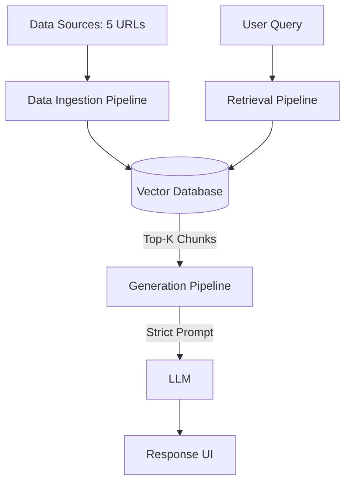

# Architecture Overview: Mutual Fund FAQ Assistant (RAG)

This document outlines the detailed system architecture for the Retrieval-Augmented Generation (RAG)-based Mutual Fund FAQ Assistant, as defined in the project context.

## 1. High-Level Architecture

The system is built on a standard RAG architecture, prioritizing factual accuracy and strict adherence to provided contexts over generalized generation. The flow consists of three primary phases: **Data Ingestion**, **Retrieval**, and **Generation**.

## 2. Component Details

### 2.1 Data Ingestion Pipeline
This pipeline runs offline (or on a scheduled basis) to process and store the mutual fund information.
- **Web Scraper/Document Loader**: Fetches the HTML content from the 5 selected HDFC mutual fund URLs.
- **Text Preprocessing**: Cleans the raw HTML, removing noise (ads, irrelevant navigation) and extracting raw factual text such as expense ratios, lock-in periods, and fund objective details.
- **Chunking Strategy**: Splits the extracted text into manageable semantic chunks (e.g., 512-1024 tokens) to ensure precise retrieval. Metadata (source URL, scrape date) is attached to every single chunk.
- **Embedding Model**: Converts chunks into high-dimensional vector representations. 
- **Vector Store**: A lightweight, persistent vector database that stores the chunks and embeddings for fast similarity search.

### 2.2 Retrieval Pipeline
This pipeline handles incoming user queries to find the most relevant facts.
- **Query Processing**: The user's query is received and optionally cleaned (e.g., removing typos).
- **Advisory Filter (Optional but Recommended)**: A lightweight semantic router or rule-based classifier to immediately detect and reject subjective/advisory queries (e.g., "Is this a good investment?") before hitting the vector database.
- **Query Embedding**: The query is vectorized using the exact same embedding model used in the ingestion phase.
- **Vector Search (Similarity)**: The vector database performs a cosine similarity search to retrieve the Top-K (e.g., K=3) most relevant text chunks containing factual data.

### 2.3 Generation Pipeline
The core intelligence layer that formulates the final answer based *only* on retrieved facts.
- **Prompt Engineering**: The LLM is provided a strict system prompt containing the retrieved chunks and the following constraints:
  - Base the answer **exclusively** on the provided context.
  - Limit the answer to a maximum of **3 sentences**.
  - Include exactly **one source link** (extracted from the chunk metadata).
  - Include the required footer: `"Last updated from sources: <date>"`.
  - Refuse to answer if the context does not contain the information or if the query requires financial advice.
- **Large Language Model (LLM)**: A fast, instruction-following LLM generates the response based strictly on the context.
- **Output Guardrails (Post-Processing)**: A final programmatic check validates that the output doesn't exceed 3 sentences, contains the link, and has the required footer.

### 2.4 User Interface
A minimal, lightweight UI.
- **Architecture**: The application currently uses a monolithic architecture where the Streamlit UI and the RAG backend (`rag_pipeline.py`) are tightly coupled and run in the same process. Scaling to a React or Mobile frontend in the future would require decoupling the backend into a standalone REST API (e.g., FastAPI).
- **Features**: 
  - Welcome message.
  - 3 pre-populated example questions (e.g., "What is the expense ratio of the HDFC Gold ETF?", "What is the exit load for the Small Cap fund?").
  - A prominent disclaimer: `"Facts-only. No investment advice."`
  - Input box and chat history.

### 2.5 Scheduler Component (Automated Refresh via GitHub Actions)
To ensure the RAG bot always has access to the latest financial data without needing an always-on backend server, the system relies on serverless CI/CD.
- **Tool**: GitHub Actions.
- **Behavior**: A daily cron job spins up a runner, installs the environment, and executes `data_ingestion.py` to rebuild the vector database.
- **Database Refresh**: The newly generated `chroma_db` is automatically committed and pushed back to the GitHub repository. When the frontend (e.g., deployed on Streamlit Community Cloud) syncs with the repository, it instantly picks up the freshly fetched data on the next user prompt.

## 3. Handling Edge Cases & Refusals

To strictly comply with the "No Financial Advice" constraint:
- **Out of Scope / Advisory Queries**: If a user asks "Which fund should I buy?", the system prompt forces the LLM to output a standard polite refusal reinforcing the facts-only limitation, coupled with an educational AMFI/SEBI link.
- **Missing Information**: If a query is factual but the answer is not present in the vector store, the LLM must reply that the information is unavailable in its current official sources.
- **Performance/Returns**: Any queries about historical returns or performance will trigger a response directing the user to the official factsheet URL rather than generating return percentages directly.

## 4. Tech Stack Recommendations
- **Orchestration**: LangChain or LlamaIndex
- **Embeddings**: HuggingFace `BAAI/bge-large-en` (BGE model)
- **Vector DB**: ChromaDB, Qdrant, or FAISS (local/lightweight)
- **LLM**: Groq (for ultra-low latency inference and strict instruction following)
- **Frontend**: Streamlit or Gradio (for rapid UI development)
